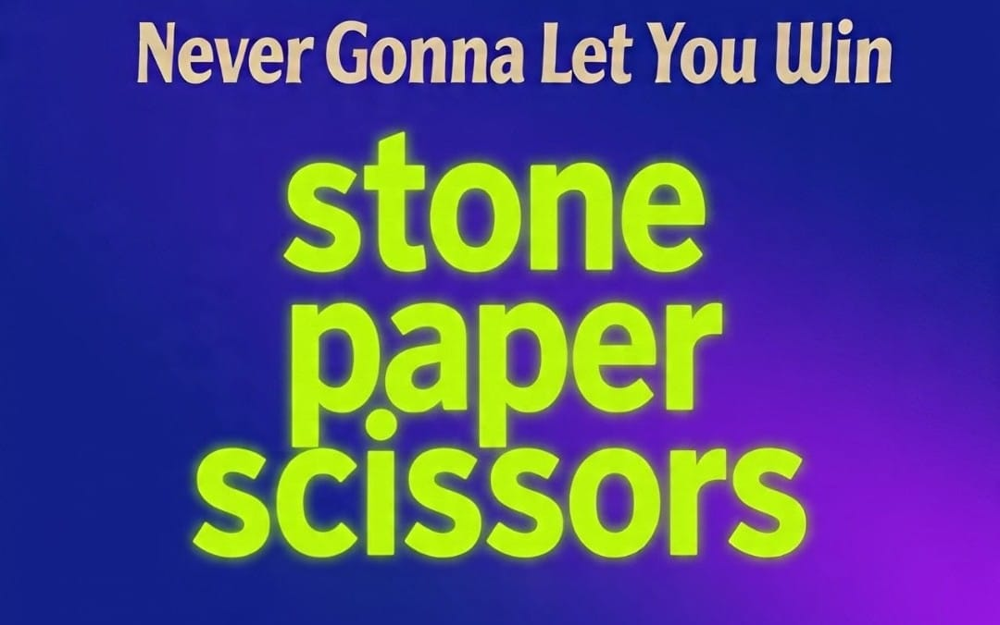

# Never Gonna Let You Win 🎯
## Basic Details
### Team Name: Vivek Venugopal's Team
### Team Members
- Team Lead: Vivek Venugopal - College of Engineering and Management Puunnapra (Vadackal)


### Project Description
A Useless Projects-built Rock-Paper-Scissors game leveraging MediaPipe for heuristic hand gesture recognition and TensorFlow for LSTM-based next-move prediction. The system offers a lag-free webcam feed with a 5-second countdown between rounds, ensuring clear result visibility. The LSTM model, trained on 5000 patterned synthetic sequences, achieves ~50–60% prediction accuracy, enhancing gameplay strategy.
### The Problem (that doesn't exist)
The traditional Rock-Paper-Scissors game relies on random selection among three options, resulting in purely chance-based outcomes that lack strategic depth and competitive engagement. This randomness limits its appeal for modern gaming applications, necessitating an intelligent system to predict player moves and enhance interactivity.
### The Solution (that nobody asked for)
To address the traditional Rock-Paper-Scissors game's lack of strategic depth due to random choices, this project employs MediaPipe for real-time hand gesture recognition and an LSTM model trained on patterned synthetic data (~50–60% accuracy) to predict player moves, creating a strategic AI opponent. A non-blocking 5-second interval ensures smooth gameplay and clear result visibility, enhancing engagement.
## Technical Details
### Technologies/Components Used
For Software:
- Python
- MediaPipe. TensorFlow, OpenCV, NumPy, scikit-learn
- [ChatGPT, Grok, VS Code]
### Implementation
For Software:MediaPipe: Real-time hand gesture recognition via landmark detection and heuristic classification.
TensorFlow/Keras: LSTM model trained on patterned synthetic data (~50–60% accuracy) for strategic move prediction.
OpenCV: Webcam capture and GUI with a non-blocking 5-second countdown.
NumPy: Efficient gesture history and data processing.
scikit-learn (optional): Validation split for LSTM training
# Installation<br>
### Clone the Repository <br>
```bash
git clone https://github.com/Vivek-Venugopal-Gits/Never-Gonna-Let-You-Win
```
<br> 

### Install required Libraries <br>

```bash
pip install -r requirements.txt
```
<br>

# Run<br>

### Train the Model <br>

```bash
python train_lstm.py
```

<br>

### Run the Main File <br>

```bash
python main.py
```

### Project Documentation
For Software:
# Screenshots (Add at least 3)
## Sample Gestures
*Paper (1) → "Paper: Smooth and covering!"* <br>
<br>
*Rock (0) → "Rock: Solid and unbreakable!"* <br>
<br>
*Scissors (2) → "Scissors: Sharp and cutting!"* <br>
<br>
# Diagrams <br>
*Webcam → Hand Detection → Gesture Classification (Rock=0, Paper=1, Scissors=2) → Numeric Encoding → LSTM Prediction → AI Counter Move → Game Result Display* br<>

# Project Demo
## Video


<a href="https://drive.google.com/file/d/1PARAEK63H7yfuktNH3fV9yEP9dUsTM8H/view?usp=sharing" target="_blank">
    
</a>


Made with ❤️ at TinkerHub Useless Projects


